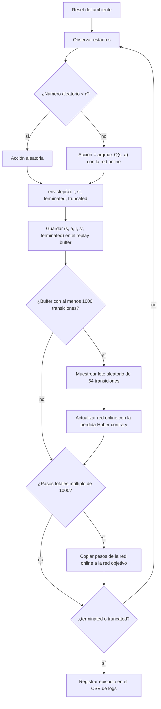
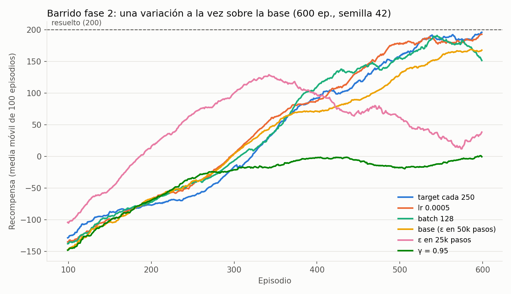
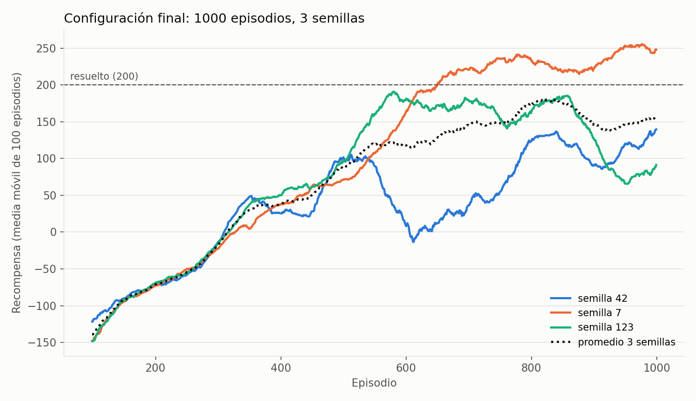

# Taller 2: agente DQN para LunarLander-v3

## Estado actual del proyecto

El ambiente seleccionado para la actividad es `LunarLander-v3` de Gymnasium.
Por ahora, los métodos Python son esqueletos: **solo registran el nombre del
método y la fecha/hora de llamada** en `results/method_calls.csv`. Todavía no
crean el ambiente, entrenan ni evalúan un agente, ni generan resultados de
aprendizaje. Las secciones sobre red y flujo describen el diseño previsto; los
resultados y reflexiones basados en datos quedan pendientes de ejecutar el
entrenamiento.

## 1. Descripción del ambiente

LunarLander simula el control de un módulo lunar que debe aterrizar entre las
banderas de una plataforma. El agente debe reducir su velocidad y orientar el
módulo para conseguir un aterrizaje seguro. Es adecuado para DQN porque tiene
observaciones numéricas y un conjunto discreto de acciones.

## 2. Espacio de observaciones y acciones

### Observaciones

El espacio de observación es un vector continuo de 8 valores:

## Tabla de observaciones

| Variable | Significado | Rango aproximado | Tipo |
|-----------|-------------|------------------|------|
| Posición X | Distancia horizontal respecto al centro | [-2.5, 2.5] | float |
| Posición Y | Altura respecto al punto de aterrizaje | [-2.5, 2.5] | float |
| Velocidad X | Velocidad horizontal | [-10, 10] | float |
| Velocidad Y | Velocidad vertical | [-10, 10] | float |
| Ángulo | Inclinación del módulo lunar (lander) | [-6.28, 6.28] | float |
| Velocidad angular | Velocidad de rotación | [-10, 10] | float |
| Contacto pata izquierda | 1 si toca el suelo, 0 si no | [0, 1] | float |
| Contacto pata derecha | 1 si toca el suelo, 0 si no | [0, 1] | float |

### Acciones

El espacio es `Discrete(4)`. Cada acción selecciona una de estas opciones:

| Acción | Efecto |
| --- | --- |
| 0 | No encender motores |
| 1 | Encender el motor principal |
| 2 | Encender el motor lateral izquierdo |
| 3 | Encender el motor lateral derecho |

### Recompensa

La recompensa combina el progreso hacia la zona de aterrizaje, la reducción
de velocidad, la orientación y el contacto de las patas. También aplica
penalizaciones por el consumo de combustible. El aterrizaje seguro recibe una
recompensa final positiva y un choque una penalización final. Por ello, no basta
con maximizar una recompensa puntual: se busca aterrizar de forma controlada y
con poco gasto de combustible.

## Componentes de la recompensa

- El módulo recibe puntos cuando se mueve hacia el centro de la zona de aterrizaje.
- Pierde puntos si se aleja de ese objetivo.
- Se premia descender con una velocidad baja y controlada.
- Se castigan las velocidades altas.
- Inclinaciones fuertes generan penalizaciones.
- Encender los motores gasta combustible y siempre genera una penalización.

## Recompensas y penalizaciones principales

| Evento | Recompensa |
|----------|------------|
| Cada pata en contacto con el suelo | +10 |
| Uso del motor lateral | -0.03 por paso |
| Uso del motor principal | -0.3 por paso |
| Aterrizaje exitoso | +100 |
| Colisión o destrucción | -100 |

## Objetivo del agente

La política óptima debe:

1. Mantenerse cerca de la plataforma.
2. Reducir la velocidad de caída de manera progresiva.
3. Mantener una orientación estable.
4. Usar el combustible con moderación.
5. Aterrizar suavemente sin chocar.

## Interpretación en Reinforcement Learning

La recompensa funciona como una guía que le dice al agente qué acciones lo acercan a un aterrizaje correcto y cuáles lo alejan de él.
Las recompensas positivas refuerzan comportamientos seguros y controlados (rutas que puede repetir), mientras que las penalizaciones evitan movimientos bruscos, inclinaciones peligrosas y el uso excesivo de motores.

## ¿Por qué no se apilan frames (el vector ya incluye velocidades).?
El estado actual tiene toda la información necesaria para la toma de decisiones, por esta razón no se apilan frames, no se hace procesamiento visual.


## 3. Flujo lógico del entrenamiento

El agente es un DQN (Deep Q-Network). Usa una red online `Q(s, a; θ)` que se entrena, y una red objetivo `Q_target` con pesos θ⁻ que se copia de la online cada 1000 pasos para que el objetivo de aprendizaje no se mueva en cada actualización.

### Ecuación de actualización (Bellman)

Para cada transición `(s, a, r, s′, terminated)` del lote se calcula el objetivo:

$$
y = r + \gamma \cdot \max_{a'} Q_{\text{target}}(s', a') \cdot (1 - \text{terminated})
$$

y se minimiza la pérdida de Huber entre `Q(s, a)` y `y`:

$$
L(\theta) = \text{Huber}\big(Q(s, a;\theta),\; y\big)
$$

- `γ = 0.99`, `learning_rate = 0.001` (Adam), gradientes recortados a norma 10.
- Se usa `terminated` y no `truncated` en el factor `(1 − done)`. Ver la subsección de particularidades más abajo.

### Diagrama del ciclo



### Exploración ε-greedy

ε decae linealmente de `1.0` a `0.05` en `100 000` pasos. Al principio el agente explora casi siempre al azar; al final actúa casi siempre según la red.

### Orden de ejecución en `train.py`

1. Por cada paso: elegir acción (ε-greedy), ejecutar `env.step`, guardar la transición.
2. Si el buffer tiene al menos 1000 transiciones, muestrear un lote y actualizar la red online.
3. Cada 1000 pasos totales, copiar la red online a la red objetivo.
4. Al terminar el episodio, escribir una fila en el CSV con `episode, reward, epsilon, loss, steps`.


## 4. Particularidades del entorno

- LunarLander combina control de posición, velocidad y orientación; una acción
  útil depende de la fase del aterrizaje.
- Los motores consumen combustible, así que mantenerlos encendidos puede
  facilitar el control inmediato, pero reduce la recompensa.
- Es importante distinguir entre aterrizaje seguro, choque y truncamiento por
  límite de tiempo: terminar por tiempo no necesariamente significa que el
  módulo haya aterrizado.
- Gymnasium requiere la dependencia de Box2D para este entorno. Antes de
  ejecutar una futura implementación del entrenamiento, se debe instalar
  `gymnasium[box2d]` además de las dependencias de PyTorch y las herramientas
  de registro/gráficas que se utilicen.

* Espacio de estados continuo

Existen prácticamente infinitos estados posibles. Por esta razón, algoritmos tabulares como Q-Learning puro no escalan bien sin discretización, el estado está compuesto por variables continuas:
Posición (x, y)
Velocidad (vx, vy)
Ángulo
Velocidad angular
Contacto de las patas
 
* Problema de control dinámico
El agente no sólo debe decidir qué hacer, sino cuándo hacerlo, por ejemplo cuando al encender demasiado el motor principal genera inestabilidad.
Las acciones tienen efectos que se propagan durante varios pasos del tiempo.

* Recompensa densa  
A diferencia de otros entornos donde la recompensa sólo aparece al final, LunarLander proporciona retroalimentación continua:
    -    acercarse al objetivo
    -    reducir velocidad
    -    mantenerse vertical
    -    tocar el suelo con las patas
    -    Optimización multiobjetivo

El agente debe optimizar varios aspectos simultáneamente:
    -   Llegar a la plataforma.
    -   Reducir velocidad.
    -   Mantener estabilidad.
    -   Ahorrar combustible.
    -   Evitar colisiones.

Muchas veces estos objetivos entran en conflicto al estabilizarse o ahorrar combustible.
El agente debe encontrar un equilibrio.

* * Alta dependencia temporal
Una acción puede afectar el resultado muchos pasos después.
* *  Física realista (Box2D)
El entorno está construido sobre Box2D.

El agente debe tener en cuenta todas las observaciones:

- gravedad
- aceleración
- momento angular
- velocidad lineal
- colisiones
- contacto de las patas

Por ello es mucho más complejo que entornos como CartPole

### Particularidades del entorno y su efecto en el entrenamiento

- **Terminación vs. truncamiento.** El episodio termina (`terminated = True`) si el módulo aterriza, choca o sale de la zona de vuelo. Se trunca (`truncated = True`) si se llega al límite de pasos. En el primer caso el futuro no tiene valor, así que el objetivo es solo `r`. En el segundo el módulo seguía en el aire y el futuro sí tiene valor, así que el objetivo debe incluir `γ · max Q_target(s′, a′)`. Si se usara `truncated` en el factor `(1 − done)`, el agente aprendería que los estados donde se corta el episodio no valen nada, lo que introduce un sesgo.
- **Límite de 500 pasos.** El ambiente trae 1000 pasos por defecto. `train.py` lo fija en 500 (`max_steps_per_episode` del config). Un agente que se queda flotando sin aterrizar termina truncado, y no debe confundirse con un aterrizaje.
- **Recompensas negativas al inicio.** Con ε alto el agente choca o gasta motor sin control, y los episodios acumulan penalizaciones grandes (−100 por choque, −0.3 por paso con el motor principal). En la corrida de prueba de 30 episodios las recompensas estuvieron entre −90 y −350. Esto es esperado; el aprendizaje debe reflejarse en la curva de recompensa a lo largo de los episodios, no en el primero.
- **Combustible como penalización constante.** Encender el motor cuesta siempre, mientras que el aterrizaje solo da recompensa al final. El agente puede aprender a no encender motores para evitar penalizaciones, pero entonces cae. Equilibrar esto es parte del problema que mide la curva de aprendizaje.
- **Acciones discretas (4).** Se puede usar DQN directamente, porque el máximo sobre acciones es exacto. Para acciones continuas habría que usar otro algoritmo.

## 5. Explicación de la red neuronal
La red (src/network.py, clase QNetwork) recibe el estado del módulo lunar (8 números) y devuelve un Q-valor por cada acción (4 números). El agente elige la acción con el Q-valor más alto.

### Arquitectura capa por capa

Es un perceptrón multicapa (MLP) 8 → 128 → 128 → 4:

| Capa | Entrada | Neuronas | Activación | Salida | Parámetros |
|------|---------|----------|------------|--------|------------|
| Oculta 1 | 8 (estado) | 128 | ReLU | 128 | 8 × 128 + 128 = 1152 |
| Oculta 2 | 128 | 128 | ReLU | 128 | 128 × 128 + 128 = 16512 |
| Salida | 128 | 4 | Ninguna (lineal) | 4 Q-valores, uno por acción | 128 × 4 + 4 = 516 |
| Total | | | | | 18180 |

Cada capa tiene un peso por cada conexión entre una entrada y una salida (entradas × salidas), más un sesgo por cada neurona de salida. En total la red tiene 18180 parámetros entrenables, valor que coincide con el que calcula PyTorch. Cerca del 91 % está en la segunda capa oculta, porque es la única que conecta 128 neuronas con otras 128.

### Justificación del diseño

Se usó un perceptrón multicapa y no una red convolucional porque el estado de LunarLander-v3 es una lista de 8 números que miden posición, velocidades, ángulo, velocidad de giro y si las patas tocan el suelo. Una red convolucional funciona cuando los datos que están juntos se relacionan entre sí, como los píxeles de una imagen. Este no es el caso: que dos valores estén uno al lado del otro no significa nada. Por eso se usan capas densas, donde cada neurona recibe los 8 números al mismo tiempo.

La salida tiene un Q-valor por acción para que una sola pasada de la red entregue los 4 valores y se pueda elegir la mejor acción con argmax. No se usó el par estado-acción como entrada ya que la red devolvería un solo número y habría que evaluarla 4 veces por cada decisión, una por acción.

Se usan dos capas ocultas de 128 neuronas porque el control del aterrizaje no es lineal: la acción correcta depende de combinaciones de variables. Por ejemplo, encender el motor principal sirve si el módulo cae rápido y además está casi derecho. Con dos capas la red puede aprender ese tipo de reglas que dependen de varias cosas a la vez. Se usan 128 neuronas porque alcanzan para este problema y la red sigue siendo pequeña. En las capas ocultas se usa ReLU porque es muy rápida de calcular. El tamaño de las capas ocultas se define con el parámetro hidden_dims, que por defecto es (128, 128), de modo que se puede cambiar sin tocar el código de la red.

La última capa no tiene activación porque los Q-valores son retornos esperados y pueden ser muy negativos (un choque da −100) o superar 200 (un aterrizaje exitoso). Usar una sigmoide, una tanh o una ReLU no permitiría llegar a esos valores.

### Replay buffer

El buffer (src/replay_buffer.py, clase ReplayBuffer) guarda las transiciones (s, a, r, s′, terminated) y devuelve lotes aleatorios para entrenar la red. Está hecho con arreglos de NumPy que se crean desde el inicio y funcionan como un buffer circular: cuando se llena, lo nuevo sobrescribe lo más antiguo.

Las transiciones se eligen al azar porque los pasos seguidos de un episodio se parecen mucho entre sí. Si la red entrenara con ellos en orden, aprendería solo de la situación más reciente y olvidaría lo aprendido en otras. Al elegirlas al azar se toman experiencias de distintos episodios y de distintos momentos del aterrizaje, y además cada transición se puede usar varias veces.

El buffer tiene un tamaño fijo y es circular para que el agente entrene con experiencias recientes, que vienen de una política cada vez mejor, sin que la memoria crezca sin límite.

El buffer guarda como señal de fin el valor terminated y no truncated. Si el módulo aterrizó o chocó, el episodio terminó de verdad y no hay recompensas futuras que sumar. En cambio, si el episodio se cortó por el límite de pasos, el módulo seguía volando y lo que venía después sí tenía valor. El buffer tiene su propia semilla para que los lotes elegidos sean los mismos cada vez que se repite el experimento.

### Hiperparámetros

Valores finales de `config.yaml`, elegidos con el barrido de hiperparámetros descrito en la sección 5.1. Los que se cambiaron respecto al primer `config.yaml` están marcados con ★.

| Hiperparámetro | Valor | Razón |
|---|---|---|
| `episodes` | 1000 | En el barrido de 600 episodios la curva seguía subiendo, así que hacía falta más entrenamiento. Con 1000, la semilla 7 resuelve el ambiente en el episodio 651. |
| `max_steps_per_episode` | 500 | Lo fijó P4 (la mitad del límite del ambiente) para que un agente que se queda flotando no gaste 1000 pasos por episodio. |
| `replay_capacity` | 100 000 | Una corrida completa genera unas 280 000 transiciones, así que el buffer guarda aproximadamente los últimos 300 episodios: suficientes para mezclar choques y aterrizajes sin entrenar con experiencias de una política muy vieja. |
| `min_replay_size` | 1000 | Se espera a tener unos 10 episodios de datos antes de entrenar, para que los primeros lotes no salgan siempre de las mismas pocas transiciones. |
| `batch_size` | 64 | Con 128 la curva llegó a un máximo parecido (190.9), pero cayó a 151.4 al final y cada actualización cuesta el doble. 64 fue más estable. |
| `gamma` (γ) | 0.99 | Horizonte efectivo de ~100 pasos, suficiente para "ver" el +100 del aterrizaje. Con γ = 0.95 (horizonte ~20 pasos) el agente aprendió a quedarse flotando: 28 de 30 episodios terminaron por tiempo. |
| `learning_rate` ★ | 0.0005 | Con 0.001 la media de los últimos 100 episodios fue 167.7; con 0.0005 subió a 192.8. Pasos más pequeños hacen que los Q-valores oscilen menos. |
| `target_update_interval` ★ | 250 | Copiar la red objetivo cada 250 pasos en vez de cada 1000 dio el mejor resultado del barrido (195.9 frente a 167.7). Con 1000 el objetivo queda demasiado desactualizado cuando la política cambia rápido. |
| `epsilon_start` | 1.0 | Al inicio la red no sabe nada; explorar al 100 % llena el buffer con experiencias variadas. |
| `epsilon_end` | 0.05 | Mantiene un 5 % de acciones aleatorias para seguir descubriendo situaciones. |
| `epsilon_decay_steps` ★ | 50 000 | **El cambio más importante.** ε decae por pasos, pero al principio los episodios duran ~100 pasos porque el módulo choca rápido. Con 100 000 pasos, después de 500 episodios ε seguía en 0.51. Con 25 000 el agente dejó de explorar demasiado pronto: llegó a 129 y luego cayó a 38. |
| `gradient_clip` | 10.0 | Las recompensas de ±100 producen errores de Bellman grandes; recortar el gradiente evita actualizaciones bruscas. No se varió. |
| `hidden_dims` | [128, 128] | Arquitectura de P3 (ver arriba). No se varió para concentrar el tiempo de cómputo en los hiperparámetros de DQN. |


## 5.1 Experimentos de hiperparámetros

### Metodología

- Se cambió **un hiperparámetro a la vez** respecto a una configuración base, con la semilla 42, y se comparó la **media de la recompensa en los últimos 100 episodios**.
- Todo se corrió en CPU (2 núcleos) con `train.py`, que ahora acepta `--set clave=valor` para sobrescribir hiperparámetros sin editar `config.yaml`, y `--tag` para nombrar los archivos de cada experimento. Por ejemplo:

  ```bash
  python train.py --episodes 600 --seed 42 --tag f2_lr5e-4 --out-dir results/barrido \
      --set epsilon_decay_steps=50000 learning_rate=0.0005
  ```

- Los CSV de todos los experimentos están en `experiments/logs/`. La tabla de resumen se genera con `python experiments/resumen_barrido.py <carpeta>` y las gráficas con `python experiments/graficas_barrido.py experiments/logs/fase2 experiments/logs/final`.

### Fase 1: barrido sobre el `config.yaml` original (500 episodios)

| Experimento | Media últimos 100 ep. | ε al final |
|---|---|---|
| ε decae en 50 000 pasos | **127.4** | 0.05 |
| γ = 0.95 | −19.9 | 0.38 |
| Target cada 250 pasos | −35.2 | 0.50 |
| Base (config original) | −38.2 | 0.51 |
| Buffer de 20 000 | −41.1 | 0.51 |
| Batch 128 | −45.2 | 0.53 |
| lr 0.0005 | −48.8 | 0.52 |
| lr 0.0001 | −49.3 | 0.50 |

**Configuración que falló y por qué:** la base original nunca dejó de explorar. Con `epsilon_decay_steps = 100 000` y episodios de ~100 pasos, en 500 episodios solo se dieron ~51 000 pasos y ε seguía en 0.51: el agente tomaba acciones al azar la mitad del tiempo. Por eso todas las variaciones que no tocaban ε quedaron entre −50 y −20 (γ = 0.95 da episodios más largos porque el agente flota, por eso su ε bajó un poco más, a 0.38), y la comparación entre ellas no era justa. La fase 2 se hizo con ε en 50 000 pasos como nueva base.

### Fase 2: barrido sobre la nueva base, ε en 50 000 pasos (600 episodios)

| Experimento | Media últimos 100 ep. | Mejor media móvil (100) | Resultado |
|---|---|---|---|
| Target cada 250 pasos | **195.9** | 195.9 | Mejor resultado |
| lr 0.0005 | 192.8 | 192.8 | Segundo mejor |
| Batch 128 | 151.4 | 190.9 | Llega alto pero se vuelve inestable al final |
| Base (ε en 50k) | 167.7 | 168.8 | Aprende de forma estable pero más lento |
| ε en 25 000 pasos | 38.3 | 128.9 | **Falló:** aprende rápido y luego colapsa |
| γ = 0.95 | −0.6 | 1.0 | **Falló:** el agente aprende a flotar |



**Configuraciones que fallaron y por qué:**

- **ε en 25 000 pasos.** Es la curva que más rápido sube (llega a 129 en el episodio 343), pero después cae hasta 38. El agente dejó de explorar cuando su política todavía era mala, y el buffer se llenó de experiencias de esa política. Al evaluarlo sin exploración, el 37 % de los episodios terminó en choque.
- **γ = 0.95.** Con γ = 0.95 una recompensa a 50 pasos vale solo 0.95⁵⁰ ≈ 0.08 de su valor, así que el +100 del aterrizaje casi no influye en los Q-valores, mientras que el −100 del choque sí está cerca. El agente aprendió a evitar el choque encendiendo el motor principal (57 % de las acciones) y quedándose en el aire: en 28 de 30 episodios de evaluación se acabó el tiempo sin aterrizar.

### Configuración final y entrenamiento con 3 semillas

Se combinaron los dos mejores cambios de la fase 2 (lr 0.0005 y target cada 250) con ε en 50 000 pasos, y se entrenó 1000 episodios con las semillas 42, 7 y 123:

```bash
python train.py --seed 42
python train.py --seed 7
python train.py --seed 123
```

Cada modelo se evaluó después con `experiments/analisis_politica.py`: 100 episodios con política greedy (ε = 0) y semillas de ambiente distintas a las de entrenamiento (1000–1099). Esta evaluación es de apoyo para el análisis de hiperparámetros; la evaluación oficial del agente está en la sección 6.

| Semilla | Media últimos 100 ep. (entrenamiento) | Mejor media móvil (100) | Evaluación greedy (100 ep.) | Ep. ≥ 200 | Aterriza | Choca | Se acaba el tiempo |
|---|---|---|---|---|---|---|---|
| 7 | 248.0 | **255.6** (ep. 977), resuelto en ep. 651 | **230.9 ± 52.5** | 64 % | 64 % | 0 % | 36 % |
| 42 | 139.5 | 139.5 (ep. 1000) | 201.0 ± 98.6 | 68 % | 76 % | 13 % | 11 % |
| 123 | 91.2 | 191.1 (ep. 581) | 133.5 ± 102.7 | 37 % | 37 % | 51 % | 12 % |
| **Promedio** | 159.6 | 195.4 | **188.5** | 56 % | 59 % | 21 % | 20 % |
| Agente aleatorio | — | — | −205.9 ± 118.6 | 0 % | 0 % | 100 % | 0 % |



- El mejor modelo es el de la **semilla 7** (`models/best_seed7.pt`): nunca choca en la evaluación. Los modelos de las otras semillas están en `models/best_seed42.pt` y `models/best_seed123.pt`.
- Cada `.pt` es el punto del entrenamiento con mejor media móvil de 100 episodios, y guarda los pesos (`state_dict`), el episodio, esa media y la configuración usada.

## 6. Resultados del entrenamiento


## 7. Reflexión sobre los resultados obtenidos

**El agente sí aprende a aterrizar, pero no de forma igual de confiable con todas las semillas.** En promedio, los modelos de las 3 semillas obtienen 188.5 puntos en evaluación greedy, frente a −205.9 del agente aleatorio, que choca en el 100 % de los episodios. La semilla 7 resuelve el ambiente (media móvil ≥ 200 desde el episodio 651) y nunca choca al evaluarla. La semilla 123, en cambio, llegó a 191 cerca del episodio 580 y luego bajó a 91, y su mejor modelo todavía choca en la mitad de los episodios. Con el mismo código y los mismos hiperparámetros, la diferencia entre la mejor y la peor semilla es de casi 100 puntos. Por eso no basta con reportar una sola corrida.

**Los colapsos durante el entrenamiento son una limitación estructural de DQN.** La semilla 42 bajó de 105 a −13 entre los episodios 513 y 612, y se recuperó después; la 123 cayó al final. Hay tres causas que se refuerzan entre sí:

- **Sobreestimación de los Q-valores.** El objetivo de Bellman usa `max_a' Q_target(s′, a′)`, y el máximo de valores con ruido tiende a ser mayor que el valor real. El agente sobrevalora algunas acciones arriesgadas hasta que choca varias veces y lo corrige. Double DQN separa la elección de la acción de su evaluación para reducir este sesgo.
- **Olvido de experiencias.** Cuando el agente ya aterriza bien, el buffer (que guarda unos 300 episodios) se llena de aterrizajes, y las transiciones de choques salen del buffer. La red "olvida" qué pasa en estados peligrosos y vuelve a cometer errores que ya había corregido.
- **Objetivo que se mueve.** La red objetivo se copia cada 250 pasos. Esto aceleró el aprendizaje en el barrido, pero también hace que el objetivo cambie seguido, y con un learning rate constante la política puede oscilar en vez de estabilizarse.

**El comportamiento aprendido se explica por el diseño del problema:**

- **Aterriza pero no se detiene.** En la semilla 7, el 36 % de los episodios terminan por tiempo, pero todos con recompensa positiva (mínimo 116.5). El módulo llega a la plataforma y sigue corrigiendo con los motores laterales, así que nunca queda en reposo (que es lo que da el +100 y termina el episodio) y el episodio se corta en el paso 500. Esto pasa porque estar apoyado en la plataforma ya da recompensa con cada paso (+10 por cada pata y el bonus por estar cerca del centro), así que el agente no tiene mucho incentivo para apagar los motores. Además, el límite de 500 pasos que se puso en `train.py` le deja menos tiempo para aprender a quedarse quieto.
- **γ define qué tan lejos "ve" el agente.** El experimento con γ = 0.95 lo mostró claramente: con un horizonte de ~20 pasos, el aterrizaje (que está a cientos de pasos) no influye en la decisión, y el agente prefiere quedarse flotando para evitar el choque. La recompensa no cambió; lo que cambió fue cómo el agente la valora en el tiempo.
- **ε por pasos y episodios de largo variable.** El calendario de ε se define en pasos, pero los episodios cambian de largo según qué tan bien juega el agente (~90 pasos cuando choca, 250–500 cuando aterriza o flota). Con 100 000 pasos el agente seguía explorando a la mitad del entrenamiento; con 25 000 dejó de explorar antes de tiempo. Elegir este valor exige pensar en cuántos episodios cortos va a tener el agente al principio, no solo en el total de pasos.

**Las métricas de entrenamiento subestiman al agente.** La media de entrenamiento incluye el 5 % de acciones aleatorias que quedan con ε = 0.05. Por ejemplo, la semilla 42 tiene 139.5 de media en entrenamiento pero 201.0 en evaluación greedy. Por eso hay que evaluar sin exploración antes de concluir algo sobre la política aprendida.

**Limitaciones del propio estudio de hiperparámetros.** Cada configuración del barrido se corrió con una sola semilla, y ya vimos que la semilla cambia el resultado hasta en 100 puntos. Por eso las diferencias pequeñas del barrido (por ejemplo, 195.9 frente a 192.8) no son concluyentes. Además, la combinación final (lr 0.0005 + target 250) no se probó antes de entrenar con 3 semillas, y con la semilla 42 dio 139.5, menos que cualquiera de los dos cambios por separado en la fase 2. Para mejorar los resultados se podría:

1. Usar Double DQN o Dueling DQN para reducir la sobreestimación.
2. Actualizar la red objetivo de forma suave (promedio de pesos) en lugar de copiarla cada 250 pasos.
3. Reducir el learning rate al final del entrenamiento.
4. Evaluar con ε = 0 cada cierto número de episodios y guardar el modelo según esa evaluación, no según la media de entrenamiento.
5. Correr cada configuración del barrido con al menos 3 semillas.

## 8. Reflexión sobre los principales retos o dificultades


