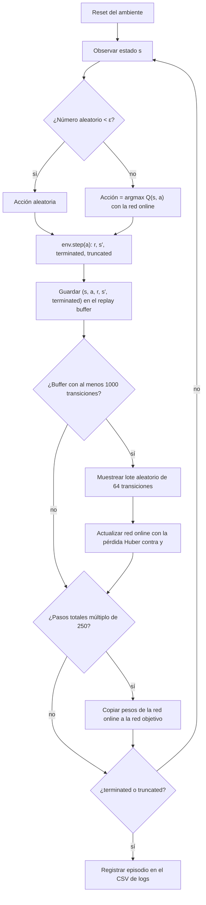
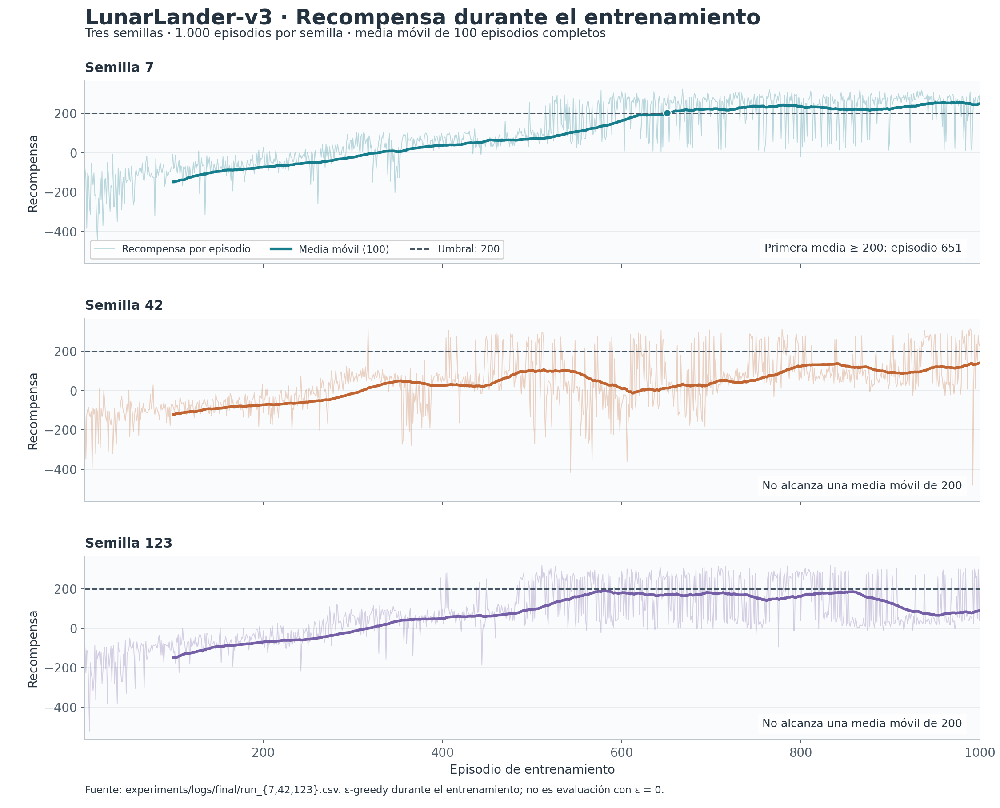
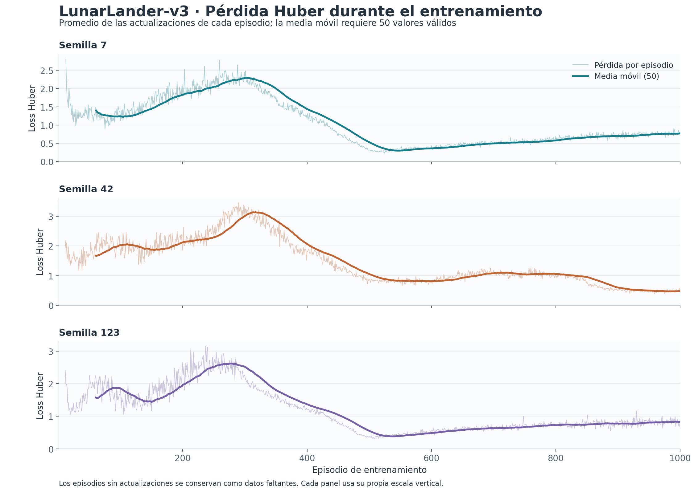
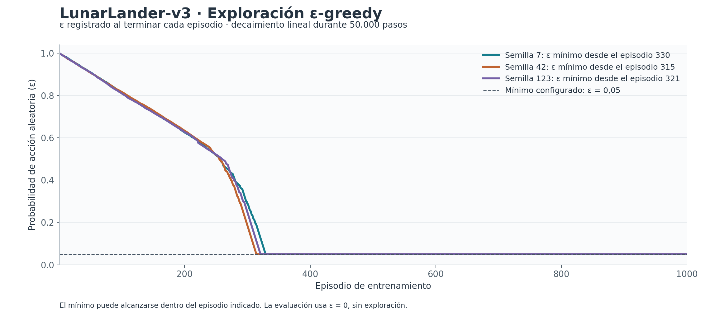
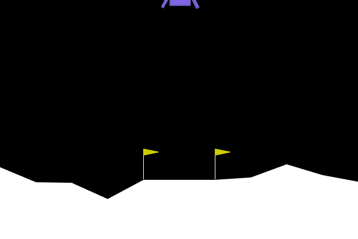

# Taller 2: agente DQN para LunarLander-v3

## Estado final del proyecto

El ambiente seleccionado es `LunarLander-v3` de Gymnasium. El agente DQN está implementado y entrenado:

- `train.py` entrena el agente y guarda los logs (`results/run_<semilla>.csv`), el mejor modelo y el modelo final (`.pt`).
- Los hiperparámetros finales están en `config.yaml` y se eligieron con el barrido de la sección 5.1.
- Los modelos entrenados con las semillas 42, 7 y 123 están en `models/`. El mejor es `models/best_seed7.pt`.
- Los logs históricos de entrenamiento están en `experiments/logs/`.
- `evaluate.py` evalúa los pesos sin exploración, compara con acciones aleatorias y guarda CSV, JSON y GIF. Las secciones 6–8 integran los resultados, conclusiones y aportes verificables del equipo.
- Esta entrega usa los modelos publicados; no vuelve a entrenarlos. La evaluación nueva y las gráficas se ejecutaron a partir de esos archivos.

### Instalación y reproducibilidad

Requiere Python 3.10 o superior compatible con las dependencias fijadas. La evaluación de esta entrega se ejecutó con Python 3.12.10 en Windows y CPU.

```bash
# Descomprimir la entrega y entrar en su carpeta
cd taller2_dqn
python -m venv .venv
source .venv/bin/activate        # En Windows: .venv\Scripts\activate
pip install -r requirements.txt
```

Estos comandos se ejecutan en la carpeta de esta entrega, que contiene los archivos nuevos del punto 6. El repositorio original enlazado como fuente todavía corresponde al estado anterior a esta integración.

Para entrenar con la configuración final (cada corrida tarda unos 20 minutos en CPU):

```bash
python train.py --seed 7         # repetir con --seed 42 y --seed 123
```

Se fijan las semillas de Python, NumPy, PyTorch, el ambiente y el replay buffer, y PyTorch usa un solo hilo para facilitar la reproducción. Esto no garantiza igualdad exacta al cambiar plataforma, dispositivo o versiones.

Para reproducir el punto 6 con los modelos incluidos, sin entrenar de nuevo:

```bash
python evaluate.py --model models/best_seed7.pt --episodes 100 --seed 20000 --gif
python experiments/plot_results.py
python -m unittest discover -s tests -v
```

El evaluador toma el límite de pasos y la arquitectura del checkpoint. `--gif` guarda el primer episodio, elegido antes de observar los resultados; el resto de episodios también se incluye en los CSV.

## 1. Descripción del ambiente

LunarLander simula el control de un módulo lunar que debe aterrizar entre las
banderas de una plataforma. El agente debe reducir su velocidad y orientar el
módulo para conseguir un aterrizaje seguro. Es adecuado para DQN porque tiene
observaciones numéricas y un conjunto discreto de acciones.

## 2. Espacio de observaciones y acciones

### Observaciones

El espacio de observación es `Box(8,)` con dtype `float32`: un vector continuo de 8 valores. Gymnasium ya entrega las posiciones y velocidades escaladas a rangos pequeños, por lo que no se aplica normalización adicional; el vector se pasa directo a la red como tensor `float32` de forma `(8,)` (o `(batch, 8)` al entrenar).


#### Tabla de observaciones

| Variable | Significado | Rango aproximado | Tipo |
|-----------|-------------|------------------|------|
| Posición X | Distancia horizontal respecto al centro | [-2.5, 2.5] | float |
| Posición Y | Altura respecto al punto de aterrizaje | [-2.5, 2.5] | float |
| Velocidad X | Velocidad horizontal | [-10, 10] | float |
| Velocidad Y | Velocidad vertical | [-10, 10] | float |
| Ángulo | Inclinación del módulo lunar (lander) | [-6.28, 6.28] | float |
| Velocidad angular | Velocidad de rotación | [-10, 10] | float |
| Contacto pata izquierda | 1 si toca el suelo, 0 si no | [0, 1] | float |
| Contacto pata derecha | 1 si toca el suelo, 0 si no | [0, 1] | float |

### Acciones

El espacio es `Discrete(4)`: una sola acción por paso, representada como un entero (`int64`) de 0 a 3. Cada acción selecciona una de estas opciones:

| Acción | Efecto |
| --- | --- |
| 0 | No encender motores |
| 1 | Encender el motor lateral izquierdo |
| 2 | Encender el motor principal |
| 3 | Encender el motor lateral derecho |

### Recompensa

La recompensa combina el progreso hacia la zona de aterrizaje, la reducción
de velocidad, la orientación y el contacto de las patas. También aplica
penalizaciones por el consumo de combustible. El aterrizaje seguro recibe una
recompensa final positiva y un choque una penalización final. Por ello, no basta
con maximizar una recompensa puntual: se busca aterrizar de forma controlada y
con poco gasto de combustible.

## Componentes de la recompensa

- El módulo recibe puntos cuando se mueve hacia el centro de la zona de aterrizaje.
- Pierde puntos si se aleja de ese objetivo.
- Se premia descender con una velocidad baja y controlada.
- Se castigan las velocidades altas.
- Inclinaciones fuertes generan penalizaciones.
- Encender los motores gasta combustible y siempre genera una penalización.

## Recompensas y penalizaciones principales

| Evento | Recompensa |
|----------|------------|
| Contacto de cada pata | +10 en el término de shaping; su pérdida revierte la contribución |
| Uso del motor lateral | -0.03 por paso |
| Uso del motor principal | -0.3 por paso |
| Aterrizaje exitoso | +100 |
| Colisión o destrucción | -100 |

El código calcula la parte densa como la diferencia entre el *shaping* actual y el anterior: mantener una pata apoyada no concede otros +10 en cada paso. Las penalizaciones de motor sí se aplican en cada paso de uso. Véase la [implementación de Gymnasium 1.1.1](https://github.com/Farama-Foundation/Gymnasium/blob/v1.1.1/gymnasium/envs/box2d/lunar_lander.py#L584-L617).

## Objetivo del agente

La política óptima debe:

1. Mantenerse cerca de la plataforma.
2. Reducir la velocidad de caída de manera progresiva.
3. Mantener una orientación estable.
4. Usar el combustible con moderación.
5. Aterrizar suavemente sin chocar.

## Interpretación en Reinforcement Learning

La recompensa funciona como una guía que le dice al agente qué acciones lo acercan a un aterrizaje correcto y cuáles lo alejan de él.
Las recompensas positivas refuerzan comportamientos seguros y controlados (rutas que puede repetir), mientras que las penalizaciones evitan movimientos bruscos, inclinaciones peligrosas y el uso excesivo de motores.

## ¿Por qué no se apilan frames (el vector ya incluye velocidades).?
El estado actual tiene toda la información necesaria para la toma de decisiones, por esta razón no se apilan frames, no se hace procesamiento visual.


## 3. Flujo lógico del entrenamiento

El agente es un DQN (Deep Q-Network). Usa una red online `Q(s, a; θ)` que se entrena, y una red objetivo `Q_target` con pesos θ⁻ que se copia de la online cada 250 pasos para que el objetivo de aprendizaje no se mueva en cada actualización.

### Ecuación de actualización (Bellman)

Para cada transición `(s, a, r, s′, terminated)` del lote se calcula el objetivo:

$$
y = r + \gamma \cdot \max_{a'} Q_{\text{target}}(s', a') \cdot (1 - \text{terminated})
$$

y se minimiza la pérdida de Huber entre `Q(s, a)` y `y`:

$$
L(\theta) = \text{Huber}\big(Q(s, a;\theta),\; y\big)
$$

- `γ = 0.99`, `learning_rate = 0.0005` (Adam), gradientes recortados a norma 10.
- Se usa `terminated` y no `truncated` en el factor `(1 − done)`. Ver la subsección de particularidades más abajo.

### Diagrama del ciclo



### Exploración ε-greedy

ε decae linealmente de `1.0` a `0.05` en `50 000` pasos. Al principio el agente explora casi siempre al azar; al final actúa casi siempre según la red.

### Orden de ejecución en `train.py`

1. Por cada paso: elegir acción (ε-greedy), ejecutar `env.step`, guardar la transición.
2. Si el buffer tiene al menos 1000 transiciones, muestrear un lote y actualizar la red online.
3. Cada 250 pasos totales, copiar la red online a la red objetivo.
4. Al terminar el episodio, escribir una fila en el CSV con `episode, reward, epsilon, loss, steps`.


## 4. Particularidades del entorno

- LunarLander combina control de posición, velocidad y orientación; una acción
  útil depende de la fase del aterrizaje.
- Los motores consumen combustible, así que mantenerlos encendidos puede
  facilitar el control inmediato, pero reduce la recompensa.
- Es importante distinguir entre aterrizaje seguro, choque y truncamiento por
  límite de tiempo: terminar por tiempo no necesariamente significa que el
  módulo haya aterrizado.
- Gymnasium requiere Box2D (el motor de física) y pygame para este entorno.
  Ambos están en `requirements.txt`. Se usa el paquete `Box2D` y no
  `box2d-py`, porque este último necesita compilarse y falla en muchos
  computadores (ver `docs/bitacora.md`).

* Espacio de estados continuo

Existen prácticamente infinitos estados posibles. Por esta razón, algoritmos tabulares como Q-Learning puro no escalan bien sin discretización, el estado está compuesto por variables continuas:
Posición (x, y)
Velocidad (vx, vy)
Ángulo
Velocidad angular
Contacto de las patas
 
* Problema de control dinámico
El agente no sólo debe decidir qué hacer, sino cuándo hacerlo, por ejemplo cuando al encender demasiado el motor principal genera inestabilidad.
Las acciones tienen efectos que se propagan durante varios pasos del tiempo.

* Recompensa densa  
A diferencia de otros entornos donde la recompensa sólo aparece al final, LunarLander proporciona retroalimentación continua:
    -    acercarse al objetivo
    -    reducir velocidad
    -    mantenerse vertical
    -    tocar el suelo con las patas
    -    Optimización multiobjetivo

El agente debe optimizar varios aspectos simultáneamente:
    -   Llegar a la plataforma.
    -   Reducir velocidad.
    -   Mantener estabilidad.
    -   Ahorrar combustible.
    -   Evitar colisiones.

Muchas veces estos objetivos entran en conflicto al estabilizarse o ahorrar combustible.
El agente debe encontrar un equilibrio.

* * Alta dependencia temporal
Una acción puede afectar el resultado muchos pasos después.
* *  Física realista (Box2D)
El entorno está construido sobre Box2D.

El agente debe tener en cuenta todas las observaciones:

- gravedad
- aceleración
- momento angular
- velocidad lineal
- colisiones
- contacto de las patas

Por ello es mucho más complejo que entornos como CartPole

### Particularidades del entorno y su efecto en el entrenamiento

- **Terminación vs. truncamiento.** El episodio termina (`terminated = True`) si el módulo aterriza, choca o sale de la zona de vuelo. Se trunca (`truncated = True`) si se llega al límite de pasos. En el primer caso el futuro no tiene valor, así que el objetivo es solo `r`. En el segundo el módulo seguía en el aire y el futuro sí tiene valor, así que el objetivo debe incluir `γ · max Q_target(s′, a′)`. Si se usara `truncated` en el factor `(1 − done)`, el agente aprendería que los estados donde se corta el episodio no valen nada, lo que introduce un sesgo.
- **Límite de 500 pasos.** El ambiente trae 1000 pasos por defecto. `train.py` lo fija en 500 (`max_steps_per_episode` del config). Un agente que se queda flotando sin aterrizar termina truncado, y no debe confundirse con un aterrizaje.
- **Recompensas negativas al inicio.** Con ε alto el agente choca o gasta motor sin control, y los episodios acumulan penalizaciones grandes (−100 por choque, −0.3 por paso con el motor principal). En la corrida de prueba de 30 episodios las recompensas estuvieron entre −90 y −350. Esto es esperado; el aprendizaje debe reflejarse en la curva de recompensa a lo largo de los episodios, no en el primero.
- **Combustible como penalización constante.** Encender el motor cuesta siempre, mientras que el aterrizaje solo da recompensa al final. El agente puede aprender a no encender motores para evitar penalizaciones, pero entonces cae. Equilibrar esto es parte del problema que mide la curva de aprendizaje.
- **Acciones discretas (4).** Se puede usar DQN directamente, porque el máximo sobre acciones es exacto. Para acciones continuas habría que usar otro algoritmo.

## 5. Explicación de la red neuronal
La red (src/network.py, clase QNetwork) recibe el estado del módulo lunar (8 números) y devuelve un Q-valor por cada acción (4 números). El agente elige la acción con el Q-valor más alto.

### Arquitectura capa por capa

Es un perceptrón multicapa (MLP) 8 → 128 → 128 → 4:

| Capa | Entrada | Neuronas | Activación | Salida | Parámetros |
|------|---------|----------|------------|--------|------------|
| Oculta 1 | 8 (estado) | 128 | ReLU | 128 | 8 × 128 + 128 = 1152 |
| Oculta 2 | 128 | 128 | ReLU | 128 | 128 × 128 + 128 = 16512 |
| Salida | 128 | 4 | Ninguna (lineal) | 4 Q-valores, uno por acción | 128 × 4 + 4 = 516 |
| Total | | | | | 18180 |

Cada capa tiene un peso por cada conexión entre una entrada y una salida (entradas × salidas), más un sesgo por cada neurona de salida. En total la red tiene 18180 parámetros entrenables, valor que coincide con el que calcula PyTorch. Cerca del 91 % está en la segunda capa oculta, porque es la única que conecta 128 neuronas con otras 128.

### Justificación del diseño

Se usó un perceptrón multicapa y no una red convolucional porque el estado de LunarLander-v3 es una lista de 8 números que miden posición, velocidades, ángulo, velocidad de giro y si las patas tocan el suelo. Una red convolucional funciona cuando los datos que están juntos se relacionan entre sí, como los píxeles de una imagen. Este no es el caso: que dos valores estén uno al lado del otro no significa nada. Por eso se usan capas densas, donde cada neurona recibe los 8 números al mismo tiempo.

La salida tiene un Q-valor por acción para que una sola pasada de la red entregue los 4 valores y se pueda elegir la mejor acción con argmax. No se usó el par estado-acción como entrada ya que la red devolvería un solo número y habría que evaluarla 4 veces por cada decisión, una por acción.

Se usan dos capas ocultas de 128 neuronas porque el control del aterrizaje no es lineal: la acción correcta depende de combinaciones de variables. Por ejemplo, encender el motor principal sirve si el módulo cae rápido y además está casi derecho. Con dos capas la red puede aprender ese tipo de reglas que dependen de varias cosas a la vez. Se usan 128 neuronas porque alcanzan para este problema y la red sigue siendo pequeña. En las capas ocultas se usa ReLU porque es muy rápida de calcular. El tamaño de las capas ocultas se define con el parámetro hidden_dims, que por defecto es (128, 128), de modo que se puede cambiar sin tocar el código de la red.

La última capa no tiene activación porque los Q-valores son retornos esperados y pueden ser muy negativos (un choque da −100) o superar 200 (un aterrizaje exitoso). Usar una sigmoide, una tanh o una ReLU no permitiría llegar a esos valores.

### Replay buffer

El buffer (src/replay_buffer.py, clase ReplayBuffer) guarda las transiciones (s, a, r, s′, terminated) y devuelve lotes aleatorios para entrenar la red. Está hecho con arreglos de NumPy que se crean desde el inicio y funcionan como un buffer circular: cuando se llena, lo nuevo sobrescribe lo más antiguo.

Las transiciones se eligen al azar porque los pasos seguidos de un episodio se parecen mucho entre sí. Si la red entrenara con ellos en orden, aprendería solo de la situación más reciente y olvidaría lo aprendido en otras. Al elegirlas al azar se toman experiencias de distintos episodios y de distintos momentos del aterrizaje, y además cada transición se puede usar varias veces.

El buffer tiene un tamaño fijo y es circular para que el agente entrene con experiencias recientes, que vienen de una política cada vez mejor, sin que la memoria crezca sin límite.

El buffer guarda como señal de fin el valor terminated y no truncated. Si el módulo aterrizó o chocó, el episodio terminó de verdad y no hay recompensas futuras que sumar. En cambio, si el episodio se cortó por el límite de pasos, el módulo seguía volando y lo que venía después sí tenía valor. El buffer tiene su propia semilla para que los lotes elegidos sean los mismos cada vez que se repite el experimento.

### Hiperparámetros

Valores finales de `config.yaml`, elegidos con el barrido de hiperparámetros descrito en la sección 5.1. Los que se cambiaron respecto al primer `config.yaml` están marcados con ★.

| Hiperparámetro | Valor | Razón |
|---|---|---|
| `episodes` | 1000 | En el barrido de 600 episodios la curva seguía subiendo, así que hacía falta más entrenamiento. Con 1000, la semilla 7 resuelve el ambiente en el episodio 651. |
| `max_steps_per_episode` | 500 | Valor del config inicial, aplicado por P4 al crear el entorno; limita a 500 pasos también la evaluación para mantener condiciones comparables. |
| `replay_capacity` | 100 000 | Una corrida completa genera unas 280 000 transiciones, así que el buffer guarda aproximadamente los últimos 300 episodios. La composición del buffer y la antigüedad de las transiciones no se midieron directamente. |
| `min_replay_size` | 1000 | Se espera a tener unos 10 episodios de datos antes de entrenar, para que los primeros lotes no salgan siempre de las mismas pocas transiciones. |
| `batch_size` | 64 | En la corrida del barrido con 128, la media móvil máxima fue 190.9 y la final 151.4. Un lote de 128 procesa el doble de transiciones que uno de 64; no se midió que el tiempo se duplicara. |
| `gamma` (γ) | 0.99 | Escala de descuento 1/(1−γ) ≈ 100 pasos; con γ = 0.95 es ≈ 20. En fase 2, γ = 0.95 terminó con media −0.6. El descuento no elimina las recompensas posteriores a esa escala. |
| `learning_rate` ★ | 0.0005 | Con 0.001 la media de los últimos 100 episodios fue 167.7; con 0.0005 subió a 192.8. Ese resultado motivó la elección; no se midió directamente la oscilación de los Q-valores. |
| `target_update_interval` ★ | 250 | Copiar la red objetivo cada 250 pasos en vez de cada 1000 dio el mejor resultado del barrido (195.9 frente a 167.7). La comparación corresponde a una sola semilla y no a una prueba del mecanismo que causó la diferencia. |
| `epsilon_start` | 1.0 | Al inicio la red no sabe nada; explorar al 100 % llena el buffer con experiencias variadas. |
| `epsilon_end` | 0.05 | Mantiene un 5 % de acciones aleatorias para seguir descubriendo situaciones. |
| `epsilon_decay_steps` ★ | 50 000 | **El cambio más importante.** ε decae por pasos, pero al principio los episodios duran ~100 pasos porque el módulo choca rápido. Con 100 000 pasos, después de 500 episodios ε seguía en 0.51. Con 25 000 la media móvil llegó a 129 y terminó en 38; los registros no prueban que la reducción de exploración causara esa caída. |
| `gradient_clip` | 10.0 | Las recompensas de ±100 producen errores de Bellman grandes; recortar el gradiente evita actualizaciones bruscas. No se varió. |
| `hidden_dims` | [128, 128] | Arquitectura de P3 (ver arriba). No se varió para concentrar el tiempo de cómputo en los hiperparámetros de DQN. |


## 5.1 Experimentos de hiperparámetros

### Metodología

- Se cambió **un hiperparámetro a la vez** respecto a una configuración base, con la semilla 42, y se comparó la **media de la recompensa en los últimos 100 episodios**.
- Todo se corrió en CPU (2 núcleos) con `train.py`, que ahora acepta `--set clave=valor` para sobrescribir hiperparámetros sin editar `config.yaml`, y `--tag` para nombrar los archivos de cada experimento. Por ejemplo:

  ```bash
  python train.py --episodes 600 --seed 42 --tag f2_lr5e-4 --out-dir results/barrido \
      --set epsilon_decay_steps=50000 learning_rate=0.0005 target_update_interval=1000
  ```

- Los CSV de todos los experimentos están en `experiments/logs/`. La tabla de resumen se genera con `python experiments/resumen_barrido.py <carpeta>` y las gráficas con `python experiments/graficas_barrido.py experiments/logs/fase2 experiments/logs/final`.

### Fase 1: barrido sobre el `config.yaml` original (500 episodios)

| Experimento | Media últimos 100 ep. | ε al final |
|---|---|---|
| ε decae en 50 000 pasos | **127.4** | 0.05 |
| γ = 0.95 | −19.9 | 0.38 |
| Target cada 250 pasos | −35.2 | 0.50 |
| Base (config original) | −38.2 | 0.51 |
| Buffer de 20 000 | −41.1 | 0.51 |
| Batch 128 | −45.2 | 0.53 |
| lr 0.0005 | −48.8 | 0.52 |
| lr 0.0001 | −49.3 | 0.50 |

**Resultado de la base original:** después de 500 episodios, ε seguía en aproximadamente 0.51 y la media de los últimos 100 episodios fue −38.2. La corrida con decaimiento en 50 000 pasos terminó con ε = 0.05 y media 127.4. Este contraste motivó usar ese calendario en la fase 2. La longitud de los episodios también cambia los pasos acumulados y, por tanto, el ε observado al final; estos registros no bastan para explicar causalmente cada diferencia entre políticas.

### Fase 2: barrido sobre la nueva base, ε en 50 000 pasos (600 episodios)

| Experimento | Media últimos 100 ep. | Mejor media móvil (100) | Resultado |
|---|---|---|---|
| Target cada 250 pasos | **195.9** | 195.9 | Mejor resultado |
| lr 0.0005 | 192.8 | 192.8 | Segundo mejor |
| Batch 128 | 151.4 | 190.9 | Llega alto pero se vuelve inestable al final |
| Base (ε en 50k) | 167.7 | 168.8 | Aprende de forma estable pero más lento |
| ε en 25 000 pasos | 38.3 | 128.9 | **Falló:** aprende rápido y luego colapsa |
| γ = 0.95 | −0.6 | 1.0 | Retorno final −0.6; no se verificó aquí su patrón de vuelo |


**Configuraciones con menor rendimiento observado:**

- **ε en 25 000 pasos:** la media móvil llegó a 128.9 y terminó en 38.3, una caída de 90.6 puntos. Reducir antes la exploración es una hipótesis para explicar este resultado; los CSV no miden la composición del buffer ni prueban esa causa.
- **γ = 0.95:** la media final fue −0.6. El descuento a 50 pasos es 0.95⁵⁰ ≈ 0.077, frente a 0.99⁵⁰ ≈ 0.605 con la configuración final. Esto describe el objetivo matemático, pero no identifica por sí solo la causa del comportamiento.

Estas comparaciones proceden de una corrida por configuración; no demuestran superioridad general ni significancia estadística. Los porcentajes de comportamiento de los modelos del barrido que narraba el README anterior no se usan como evidencia principal porque no se publicaron sus registros de evaluación por episodio.

### Configuración final y entrenamiento con 3 semillas

Se combinaron los dos mejores cambios de la fase 2 (lr 0.0005 y target cada 250) con ε en 50 000 pasos, y se entrenó 1000 episodios con las semillas 42, 7 y 123:

```bash
python train.py --seed 42
python train.py --seed 7
python train.py --seed 123
```

El repositorio ya reportaba una evaluación exploratoria de apoyo con `experiments/analisis_politica.py`, sobre las semillas 1000–1099. Esos valores históricos no se mezclan con la evaluación nueva: la sección 6 publica CSV completos de 100 episodios por modelo sobre 20000–20099, elegidos después de fijar el modelo principal.

Los archivos `models/best_seed7.pt`, `models/best_seed42.pt` y `models/best_seed123.pt` guardan los pesos, la semilla, el episodio y la configuración. Cada checkpoint corresponde a la mejor media móvil de 100 episodios de su corrida. El modelo principal es el de la semilla 7; sus pesos permanecen sin cambios en esta entrega.

## 6. Resultados del entrenamiento

### 6.1 Datos de entrenamiento y criterio de resolución

Se analizaron **tres corridas de 1000 episodios**, semillas 7, 42 y 123, con la configuración final: red 8 → 128 → 128 → 4, Adam con learning rate 0.0005, γ = 0.99, batch de 64, replay buffer de 100 000 transiciones, actualización de la red objetivo cada 250 pasos y ε de 1.0 a 0.05 en 50 000 pasos. Los tres CSV suman **825 740 pasos**. Estos datos son históricos y fueron publicados por el equipo; esta entrega no ejecutó un entrenamiento nuevo.

El retorno de un episodio es la suma de sus recompensas. Para este taller se considera **resuelta una corrida en el primer episodio cuya media de los últimos 100 episodios completos es ≥ 200**. Se calcula una media móvil retrospectiva, sin rellenar los primeros 99 episodios. El criterio se aplica bajo el límite de **500 pasos** utilizado por el proyecto; no es una evaluación del entorno con su límite predeterminado de 1000.

| Semilla | Media últimos 100 | Mejor media móvil100 / episodio | Primer episodio resuelto | Mejor recompensa individual / episodio |
|---|---:|---:|---:|---:|
| 7 | 247.98 | 255.56 / 977 | 651 | 322.38 / 866 |
| 42 | 139.53 | 139.53 / 1000 | No alcanzado en 1000 | 312.19 / 989 |
| 123 | 91.20 | 191.05 / 581 | No alcanzado en 1000 | 319.34 / 511 |

La **semilla 7 resolvió el ambiente en el episodio 651**, con media móvil 200.70, y se mantuvo en ≥ 200 hasta el episodio 1000. Su checkpoint seleccionado corresponde al **episodio 977**, cuando la media móvil fue **255.56**. El episodio de resolución, el del mejor checkpoint y el del mejor retorno individual (322.38 en el episodio 866) son métricas distintas. Las otras dos corridas no alcanzaron el criterio de resolución.

Fuente: [CSV originales](experiments/logs/final), [resumen calculado](results/training/training_summary.csv) y [metodología y valores completos](results/training/training_summary.json). El resumen usa las recompensas de los CSV, redondeadas originalmente a cuatro decimales; el checkpoint conserva más precisión para su media móvil.

### 6.2 Protocolo de evaluación con ε = 0

Se ejecutó [evaluate.py](evaluate.py) con **100 episodios** de `LunarLander-v3` para el modelo `models/best_seed7.pt`, sin modificar los pesos ni elegir otro modelo tras observar los resultados. La red se cargó en modo evaluación y las acciones se eligieron con `argmax Q(s,a)`, sin exploración ni actualizaciones de aprendizaje. Se usó CPU, un hilo de PyTorch y un máximo de **500 pasos por episodio**, tomado de la configuración del checkpoint.

Los reinicios utilizan las semillas **20000–20099**. Son distintas de las semillas iniciales de entrenamiento y del conjunto exploratorio 1000–1099 que el repositorio había usado para comparar modelos. La **línea base aleatoria** utiliza los mismos 100 reinicios y el mismo límite temporal; cada acción se obtiene uniformemente de las cuatro disponibles mediante un generador NumPy local con semilla 20000. Esto empareja los estados iniciales, aunque las trayectorias divergen al tomar acciones diferentes.

Como análisis complementario se evaluaron también los checkpoints de las semillas 42 y 123 con el mismo protocolo, sin cambiar la selección principal. La línea base se repitió con idénticos resultados; representa los mismos 100 episodios aleatorios, no 300 muestras independientes.

Se registraron por episodio semilla, retorno, pasos, `terminated`, `truncated`, recompensa terminal y tipo de final. Un **aterrizaje** requiere terminación con recompensa terminal +100; un **choque/salida** es una terminación no exitosa; un **corte por tiempo** es truncamiento sin terminación. Alcanzar retorno ≥ 200 se cuenta por separado y no sustituye la clasificación del final.

### 6.3 Métricas concretas y comparación con la línea base

**El mejor modelo obtuvo 239.23 ± 52.17 puntos en los 100 episodios de evaluación con ε = 0, frente a -170.39 ± 97.74 del agente aleatorio. La diferencia media fue de +409.63 puntos.** La mejor recompensa de evaluación fue **320.43**, en el episodio **18** (semilla de entorno **20017**); la mínima fue 131.37.

| Política | Recompensa media ± desviación | Mínima | Mejor recompensa | Episodios ≥ 200 | Aterrizajes | Choques/salidas | Cortes por tiempo |
|---|---:|---:|---:|---:|---:|---:|---:|
| DQN semilla 7 (principal) | 239.23 ± 52.17 | 131.37 | 320.43 | 67 | 66 | 0 | 34 |
| Aleatorio (línea base) | -170.39 ± 97.74 | -463.04 | 0.01 | 0 | 0 | 100 | 0 |
| DQN semilla 42 (complementario) | 173.24 ± 109.91 | -359.33 | 316.48 | 53 | 64 | 23 | 13 |
| DQN semilla 123 (complementario) | 136.03 ± 112.70 | -147.88 | 317.53 | 38 | 38 | 49 | 13 |

Cada fila tiene 100 episodios; por tanto, los conteos también equivalen a porcentajes. La desviación estándar describe la dispersión de los 100 retornos y se calcula con **`ddof=0`**; no es el error estándar ni un intervalo de confianza. En los archivos de entrenamiento, los campos de desviación identifican expresamente si usan `ddof=0` o `ddof=1`.

El modelo principal superó a la política aleatoria en **100 de los 100 pares de reinicios**. Su mediana fue 260.31 y utilizó 315.37 pasos por episodio, frente a 89.82 de la línea base. Una duración mayor no demuestra por sí sola mejor control: también puede reflejar episodios que llegan al límite de tiempo.

Los **67 episodios con retorno ≥ 200** y los **66 aterrizajes** miden cosas distintas. Aunque no se observaron choques/salidas en esta muestra del modelo principal, **34 episodios terminaron por tiempo**. Estos datos sustentan una mejora respecto a acciones aleatorias, pero no una garantía de aterrizaje en todos los escenarios.

Datos completos: [DQN principal](results/evaluation/evaluation_episodes.csv), [línea base](results/evaluation/random_baseline_episodes.csv), [resumen y procedencia](results/evaluation/evaluation_summary.json), [semilla 42](results/evaluation_seed42/evaluation_summary.json) y [semilla 123](results/evaluation_seed123/evaluation_summary.json). Los decimales de las tablas se redondean solo para presentación; las diferencias se calculan con los valores completos.

### 6.4 Gráficas: recompensa, pérdida y exploración

**Recompensa por episodio y media móvil de 100 episodios, para las tres semillas.** La línea tenue conserva las oscilaciones individuales y la línea gruesa muestra la tendencia; la línea discontinua marca 200 puntos.



**Pérdida Huber por episodio y media móvil de 50 episodios.** La pérdida es el promedio de las actualizaciones realizadas dentro de cada episodio. Los 11, 10 y 10 episodios iniciales sin actualización de las semillas 7, 42 y 123 se mantienen como valores ausentes; no se rellenan con cero. Cada panel de pérdida usa su propia escala vertical.



**Evolución de ε durante el entrenamiento.** El calendario es lineal por pasos, por eso llega a 0.05 en episodios distintos. El ε de estas curvas pertenece al entrenamiento; toda la evaluación anterior usa exactamente ε = 0.



| Semilla | Loss media: primeros 100 episodios con dato | Loss media: últimos 100 con dato | Episodio que alcanza ε = 0.05 |
|---|---:|---:|---:|
| 7 | 1.3154 | 0.7525 | 330 |
| 42 | 1.8634 | 0.4850 | 315 |
| 123 | 1.6512 | 0.8151 | 321 |

La semilla 42 termina con pérdida media **0.4850**, menor que **0.7525** de la semilla 7, pero su recompensa media final de entrenamiento es **139.53**, frente a **247.98**. Este contraste muestra que la pérdida, por sí sola, no basta para seleccionar la mejor política; las distribuciones de transiciones y los objetivos de aprendizaje varían entre corridas.

Las tres figuras y los resúmenes se regeneran con `python experiments/plot_results.py`. Las series derivadas se guardan en `results/training/derived_run_<semilla>.csv`.

### 6.5 GIF del agente

El GIF muestra el **primer episodio de evaluación**, con semilla **20000**, elegido antes de conocer su resultado. Obtuvo **262.20 puntos**, duró **318 pasos** y terminó en aterrizaje. Se capturó un fotograma cada dos pasos y se reproduce a 25 fotogramas por segundo, conservando aproximadamente la duración simulada. Es una ilustración de ese episodio, no un sustituto de las métricas de los 100.



[Descargar GIF](results/evaluation/agent.gif).

### 6.6 Reproducción de los resultados

Desde la raíz de esta entrega, con las dependencias de `requirements.txt` instaladas:

```bash
# Evaluación principal y GIF (100 episodios por política)
python evaluate.py --model models/best_seed7.pt --episodes 100 --seed 20000 --gif

# Evaluaciones complementarias de las otras semillas
python evaluate.py --model models/best_seed42.pt --episodes 100 --seed 20000 --out-dir results/evaluation_seed42
python evaluate.py --model models/best_seed123.pt --episodes 100 --seed 20000 --out-dir results/evaluation_seed123

# Curvas y métricas históricas, sin volver a entrenar
python experiments/plot_results.py

# Comprobaciones del evaluador
python -m unittest discover -s tests -v
```

Se utilizó Python 3.12.10, Gymnasium 1.1.1, Box2D 2.3.10, PyTorch 2.7.1 en CPU, NumPy 2.2.6, pygame 2.6.1 e imageio 2.37.0. El JSON de cada evaluación registra las versiones, configuración, semillas y huella SHA-256 del modelo. El checkpoint principal tiene SHA-256 `ad7dfc3d72ed15b5f61fb8865a0aa4c2ca128982c2385d256529d922a20c53b8`. Las semillas ayudan a reproducir las corridas, pero no garantizan igualdad bit a bit entre sistemas distintos.

## 7. Conclusiones sustentadas en los resultados

1. **La política principal supera ampliamente la línea base bajo este protocolo.** Su media de 239.23 frente a -170.39 representa una mejora absoluta de 409.63 puntos, y gana en 100/100 pares. No se expresa como porcentaje de mejora porque la referencia tiene recompensa negativa.
2. **Se cumple el umbral de rendimiento, con una limitación de finalización.** La semilla 7 alcanza media móvil ≥ 200 en entrenamiento desde el episodio 651 y obtiene media de evaluación 239.23. Sin embargo, solo 66/100 episodios evaluados terminan en aterrizaje y 34/100 se cortan por tiempo. Una media superior a 200 no prueba éxito físico en todos los episodios; cero choques/salidas observados tampoco implica riesgo futuro nulo.
3. **La semilla afecta de forma material al resultado observado.** Solo 1 de 3 entrenamientos alcanzó el criterio de resolución. En evaluación nueva, las medias de las semillas 7, 42 y 123 son 239.23, 173.24 y 136.03: una diferencia de 103.20 puntos entre los extremos. La media del mejor modelo no representa a todas las ejecuciones de DQN.
4. **Conservar el mejor checkpoint es relevante cuando el rendimiento cae.** La semilla 123 tuvo su mejor media móvil en el episodio 581 con 191.05, pero terminó con 91.20, una caída de 99.85 puntos. En la semilla 7, el máximo de 255.56 se alcanzó en el episodio 977 y la media final fue 247.98. Estas cifras justifican distinguir el checkpoint seleccionado del estado final del entrenamiento; no demuestran el mecanismo causal de la caída.
5. **La pérdida y la exploración deben interpretarse junto con la recompensa.** La pérdida final de la semilla 42 fue inferior a la de la semilla 7 (0.4850 frente a 0.7525), pero su rendimiento fue menor. Las tres semillas llegaron a ε = 0.05 entre los episodios 315 y 330, y aun así solo una resolvió el ambiente. Reducir pérdida o exploración no es una prueba suficiente de éxito.
6. **El alcance de la evidencia es concreto.** Se dispone de tres entrenamientos, una sola semilla por configuración del barrido y 100 episodios de evaluación por checkpoint. No se evaluaron otros límites temporales, viento ni entornos distintos; tampoco se ejecutaron ablaciones que separen los efectos de sobreestimación, replay buffer y red objetivo. Esas explicaciones se mantienen como hipótesis. Evaluar Double DQN, cambios en la actualización objetivo o un calendario de learning rate, con varias semillas y el mismo protocolo, sería trabajo futuro; no se afirma que vaya a mejorar los números sin medirlo.

## 8. Reflexión sobre los principales retos o dificultades

Esta reflexión integra la bitácora y los cambios verificables del repositorio. Los aportes se atribuyen a las cuentas que registran los commits; no se presentan como testimonios personales ni como una medición del tiempo invertido por cada integrante.

El reto central que emerge de la [bitácora](docs/bitacora.md) fue convertir componentes desarrollados por separado en un experimento que pudiera ejecutarse, evaluarse y explicarse con el mismo criterio. La estructura inicial, la descripción del ambiente, la red, el replay buffer, el agente y el barrido de hiperparámetros aportaron partes necesarias; la integración exigió acordar interfaces, dependencias, rutas y métricas.

| Cuenta registrada | Aporte comprobado e integración en el resultado | Evidencia |
|---|---|---|
| `cesa96` | Creó el README inicial, punto de partida de la documentación compartida. | [Commit 986b804](https://github.com/cesa96/taller2_dqn/commit/986b804e82f91e71d9e89a0ba6ec4dad096af9cb) |
| `carcaicerock123` | Amplió la descripción de observaciones, recompensas y particularidades del ambiente; desarrolló en `evaluate.py` una inspección del entorno. Esa versión describe el ambiente, pero no carga ni evalúa pesos entrenados: el punto 6 completa esa función. | [Documentación fb53a57](https://github.com/cesa96/taller2_dqn/commit/fb53a573869db7500b106422c8d5a8c93c765a90), [inspección ed8ee41](https://github.com/cesa96/taller2_dqn/commit/ed8ee4192fde5e5a9c88802712185e51c917d3c0) |
| `sabrina-mf` | Implementó `QNetwork`, el buffer circular y su adaptación a las firmas compartidas; documentó la arquitectura 8 → 128 → 128 → 4 y sus 18 180 parámetros. | [Red cdbdd5c](https://github.com/cesa96/taller2_dqn/commit/cdbdd5c2df6e34947e943766bc1d27b81f85bb83), [buffer 5a69e73](https://github.com/cesa96/taller2_dqn/commit/5a69e73c18cdc6c2363b75112b1c58f839dde499), [README dc7c073](https://github.com/cesa96/taller2_dqn/commit/dc7c07377f9deef46a2c870f250a0ca1ca9981d6) |
| `Camilobrle` | Implementó `DQNAgent`, el ciclo de entrenamiento y la bitácora P4. Documentó y aplicó la distinción entre terminación y truncamiento, el límite de 500 pasos y la reducción de escritura de logs durante el entrenamiento. | [Agente 6bf6646](https://github.com/cesa96/taller2_dqn/commit/6bf664690f3618d32bd91081bb7d7d4df0810f4f), [entrenamiento 1b94852](https://github.com/cesa96/taller2_dqn/commit/1b94852dea23fe047476516a415ebcadbf5bc454), [bitácora 6930e34](https://github.com/cesa96/taller2_dqn/commit/6930e34d1c05d5c5b455a4ba9784ffadb142a5c6) |
| `arciniegasmariapaula` | Incorporó el barrido de hiperparámetros, los modelos y CSV de tres semillas, los gráficos y el análisis de políticas; agregó guardado de checkpoints y opciones de configuración. También actualizó dependencias y eliminó el buffer duplicado. | [Configuración y guardado 93a1ae0](https://github.com/cesa96/taller2_dqn/commit/93a1ae0240c64922efd6fe1a69ae8323b66dc7e5), [experimentos d198477](https://github.com/cesa96/taller2_dqn/commit/d1984779859061091ceb873b4b5eb1b8aa2d64d0), [dependencias 120b7d1](https://github.com/cesa96/taller2_dqn/commit/120b7d10183f05e76c94627a4396fca4e410d846), [limpieza db14a4a](https://github.com/cesa96/taller2_dqn/commit/db14a4a256183db27d1d9c5b69512b66d4e1ab18) |

El historial también registra la creación del esqueleto, `config.yaml`, dependencias y módulos bajo el autor **Cesar Garcia**, en el [commit 6d9e28c](https://github.com/cesa96/taller2_dqn/commit/6d9e28cbc2d008f6e72f8c2404c97c50604046ad). GitHub no asocia ese commit a una cuenta en los datos consultados; se conserva esta atribución sin suponer que representa a una sexta persona ni unir identidades sin confirmación.

Las dificultades que sí quedaron documentadas permiten extraer estas lecciones:

1. **Hacer compatible el trabajo del equipo.** La bitácora P4 registra dos versiones de `ReplayBuffer` y firmas diferentes. El entrenamiento importa `src/replay_buffer.py`, y el historial confirma la adaptación de su interfaz y la posterior eliminación de `Replay_buffer.py`. Acordar desde el inicio nombres, argumentos y tipos habría reducido esta ambigüedad. La bitácora también registra dificultades al instalar Box2D y al resolver las rutas de salida.
2. **Interpretar correctamente el final de un episodio.** Un corte a los 500 pasos no equivale a aterrizar ni a chocar. El código guarda `terminated` para calcular el objetivo de Bellman y usa `terminated or truncated` para detener el episodio. Esta distinción también debe mantenerse al reportar resultados; una recompensa alta, por sí sola, no prueba un aterrizaje completo.
3. **Relacionar exploración, pasos y episodios.** La configuración base del primer barrido terminó con ε ≈ 0.51 y media final de −38.2; el experimento de esa fase con decaimiento en 50 000 pasos terminó con ε = 0.05 y 127.4. Este contraste motivó la segunda fase. Como cada configuración se probó con una sola semilla, constituye evidencia de esa corrida, no una garantía general sobre el mejor calendario de exploración.
4. **Aprender a reportar variabilidad sin ocultarla.** Las medias de los últimos 100 episodios fueron 247.98, 139.53 y 91.20 para las semillas 7, 42 y 123: una diferencia de 156.77 puntos entre extremos. Solo la semilla 7 alcanzó media móvil de 100 episodios ≥ 200, por primera vez en el episodio 651. La semilla 42 cayó de 105.22 a −13.42 entre los episodios 513 y 612. Estos datos justifican mostrar todas las curvas y conservar el mejor checkpoint; no identifican por sí mismos la causa de cada caída.
5. **Separar resultados, explicaciones e hipótesis.** El README previo incluía interpretaciones causales que los registros no verifican. Sobreestimación, cambios en el buffer y actualización de la red objetivo son hipótesis que requerirían mediciones o experimentos adicionales. La evaluación sin exploración, la línea base aleatoria y la distinción entre aterrizaje y truncamiento convierten el punto 6 en una evidencia verificable. No se atribuye una mejora de evaluación exclusivamente a ε cuando también cambia el checkpoint, la distribución de estados o el conjunto de episodios.

El aprendizaje colectivo documentado es que implementar DQN y demostrar qué logró son tareas distintas: los componentes permiten entrenar, mientras que los checkpoints, CSV, semillas, métricas y videos permiten revisar el resultado. Los próximos experimentos deberían repetir el barrido con varias semillas y comparar modificaciones bajo el mismo protocolo antes de afirmar que una de ellas corrige la inestabilidad.

La integración actual del **punto 6** añade el evaluador completo, los registros nuevos de evaluación, las tres gráficas, el GIF y esta revisión de conclusiones. Los cambios no se atribuyen a una cuenta histórica del equipo: se distinguen de sus contribuciones publicadas. El reto de esta integración fue mantener separados entrenamiento, selección de modelo y evaluación, y comprobar que cada cifra tuviera un archivo de respaldo.

## 9. Procedencia de esta entrega

Base: [repositorio cesa96/taller2_dqn](https://github.com/cesa96/taller2_dqn), [commit 55bbe5a](https://github.com/cesa96/taller2_dqn/tree/55bbe5a13113670ae53399b38b6f0a23a7350607). Los pesos y CSV históricos se conservan sin modificaciones. La evaluación nueva se ejecutó el 10 de octubre de 2026, hora de Colombia (11 de octubre en los registros UTC).

- [Procedencia y huellas de archivos fuente](docs/procedencia.json).
- [Aportes y evidencia del historial](docs/aportes_evidencia.json).
- [Bitácora original del equipo](docs/bitacora.md), conservada como documento histórico: algunos pendientes descritos allí ya fueron resueltos en commits posteriores.
- [Verificación de la entrega](docs/verificacion.md).

La inspección original del entorno que estaba en `evaluate.py` se conserva en [experiments/inspect_environment.py](experiments/inspect_environment.py). El nuevo `evaluate.py` cumple la función de evaluación del punto 6.
