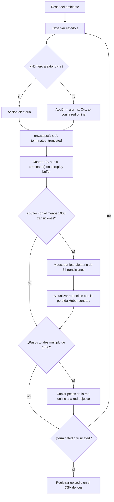

# Taller 2: agente DQN para LunarLander-v3

## Estado actual del proyecto

El ambiente seleccionado para la actividad es `LunarLander-v3` de Gymnasium.
Por ahora, los métodos Python son esqueletos: **solo registran el nombre del
método y la fecha/hora de llamada** en `results/method_calls.csv`. Todavía no
crean el ambiente, entrenan ni evalúan un agente, ni generan resultados de
aprendizaje. Las secciones sobre red y flujo describen el diseño previsto; los
resultados y reflexiones basados en datos quedan pendientes de ejecutar el
entrenamiento.

## 1. Descripción del ambiente

LunarLander simula el control de un módulo lunar que debe aterrizar entre las
banderas de una plataforma. El agente debe reducir su velocidad y orientar el
módulo para conseguir un aterrizaje seguro. Es adecuado para DQN porque tiene
observaciones numéricas y un conjunto discreto de acciones.

## 2. Espacio de observaciones y acciones

### Observaciones

El espacio de observación es un vector continuo de 8 valores:

## Tabla de observaciones

| Variable | Significado | Rango aproximado | Tipo |
|-----------|-------------|------------------|------|
| Posición X | Distancia horizontal respecto al centro | [-2.5, 2.5] | float |
| Posición Y | Altura respecto al punto de aterrizaje | [-2.5, 2.5] | float |
| Velocidad X | Velocidad horizontal | [-10, 10] | float |
| Velocidad Y | Velocidad vertical | [-10, 10] | float |
| Ángulo | Inclinación del módulo lunar (lander) | [-6.28, 6.28] | float |
| Velocidad angular | Velocidad de rotación | [-10, 10] | float |
| Contacto pata izquierda | 1 si toca el suelo, 0 si no | [0, 1] | float |
| Contacto pata derecha | 1 si toca el suelo, 0 si no | [0, 1] | float |

### Acciones

El espacio es `Discrete(4)`. Cada acción selecciona una de estas opciones:

| Acción | Efecto |
| --- | --- |
| 0 | No encender motores |
| 1 | Encender el motor principal |
| 2 | Encender el motor lateral izquierdo |
| 3 | Encender el motor lateral derecho |

### Recompensa

La recompensa combina el progreso hacia la zona de aterrizaje, la reducción
de velocidad, la orientación y el contacto de las patas. También aplica
penalizaciones por el consumo de combustible. El aterrizaje seguro recibe una
recompensa final positiva y un choque una penalización final. Por ello, no basta
con maximizar una recompensa puntual: se busca aterrizar de forma controlada y
con poco gasto de combustible.

## Componentes de la recompensa

- El módulo recibe puntos cuando se mueve hacia el centro de la zona de aterrizaje.
- Pierde puntos si se aleja de ese objetivo.
- Se premia descender con una velocidad baja y controlada.
- Se castigan las velocidades altas.
- Inclinaciones fuertes generan penalizaciones.
- Encender los motores gasta combustible y siempre genera una penalización.

## Recompensas y penalizaciones principales

| Evento | Recompensa |
|----------|------------|
| Cada pata en contacto con el suelo | +10 |
| Uso del motor lateral | -0.03 por paso |
| Uso del motor principal | -0.3 por paso |
| Aterrizaje exitoso | +100 |
| Colisión o destrucción | -100 |

## Objetivo del agente

La política óptima debe:

1. Mantenerse cerca de la plataforma.
2. Reducir la velocidad de caída de manera progresiva.
3. Mantener una orientación estable.
4. Usar el combustible con moderación.
5. Aterrizar suavemente sin chocar.

## Interpretación en Reinforcement Learning

La recompensa funciona como una guía que le dice al agente qué acciones lo acercan a un aterrizaje correcto y cuáles lo alejan de él.
Las recompensas positivas refuerzan comportamientos seguros y controlados (rutas que puede repetir), mientras que las penalizaciones evitan movimientos bruscos, inclinaciones peligrosas y el uso excesivo de motores.

## ¿Por qué no se apilan frames (el vector ya incluye velocidades).?
El estado actual tiene toda la información necesaria para la toma de decisiones, por esta razón no se apilan frames, no se hace procesamiento visual.

## 3. Flujo lógico del entrenamiento

El agente es un DQN (Deep Q-Network). Usa una red online `Q(s, a; θ)` que se entrena, y una red objetivo `Q_target` con pesos θ⁻ que se copia de la online cada 1000 pasos para que el objetivo de aprendizaje no se mueva en cada actualización.

### Ecuación de actualización (Bellman)

Para cada transición `(s, a, r, s′, terminated)` del lote se calcula el objetivo:

$$
y = r + \gamma \cdot \max_{a'} Q_{\text{target}}(s', a') \cdot (1 - \text{terminated})
$$

y se minimiza la pérdida de Huber entre `Q(s, a)` y `y`:

$$
L(\theta) = \text{Huber}\big(Q(s, a;\theta),\; y\big)
$$

- `γ = 0.99`, `learning_rate = 0.001` (Adam), gradientes recortados a norma 10.
- Se usa `terminated` y no `truncated` en el factor `(1 − done)`. Ver la subsección de particularidades más abajo.

### Diagrama del ciclo

### Exploración ε-greedy

ε decae linealmente de `1.0` a `0.05` en `100 000` pasos. Al principio el agente explora casi siempre al azar; al final actúa casi siempre según la red.

### Orden de ejecución en `train.py`

1. Por cada paso: elegir acción (ε-greedy), ejecutar `env.step`, guardar la transición.
2. Si el buffer tiene al menos 1000 transiciones, muestrear un lote y actualizar la red online.
3. Cada 1000 pasos totales, copiar la red online a la red objetivo.
4. Al terminar el episodio, escribir una fila en el CSV con `episode, reward, epsilon, loss, steps`.

## 4. Particularidades del entorno

- LunarLander combina control de posición, velocidad y orientación; una acción
  útil depende de la fase del aterrizaje.
- Los motores consumen combustible, así que mantenerlos encendidos puede
  facilitar el control inmediato, pero reduce la recompensa.
- Es importante distinguir entre aterrizaje seguro, choque y truncamiento por
  límite de tiempo: terminar por tiempo no necesariamente significa que el
  módulo haya aterrizado.
- Gymnasium requiere la dependencia de Box2D para este entorno. Antes de
  ejecutar una futura implementación del entrenamiento, se debe instalar
  `gymnasium[box2d]` además de las dependencias de PyTorch y las herramientas
  de registro/gráficas que se utilicen.

* Espacio de estados continuo

Existen prácticamente infinitos estados posibles. Por esta razón, algoritmos tabulares como Q-Learning puro no escalan bien sin discretización, el estado está compuesto por variables continuas:
Posición (x, y)
Velocidad (vx, vy)
Ángulo
Velocidad angular
Contacto de las patas
 
* Problema de control dinámico
El agente no sólo debe decidir qué hacer, sino cuándo hacerlo, por ejemplo cuando al encender demasiado el motor principal genera inestabilidad.
Las acciones tienen efectos que se propagan durante varios pasos del tiempo.

* Recompensa densa  
A diferencia de otros entornos donde la recompensa sólo aparece al final, LunarLander proporciona retroalimentación continua:
    -    acercarse al objetivo
    -    reducir velocidad
    -    mantenerse vertical
    -    tocar el suelo con las patas
    -    Optimización multiobjetivo

El agente debe optimizar varios aspectos simultáneamente:
    -   Llegar a la plataforma.
    -   Reducir velocidad.
    -   Mantener estabilidad.
    -   Ahorrar combustible.
    -   Evitar colisiones.

Muchas veces estos objetivos entran en conflicto al estabilizarse o ahorrar combustible.
El agente debe encontrar un equilibrio.

* * Alta dependencia temporal
Una acción puede afectar el resultado muchos pasos después.
* *  Física realista (Box2D)
El entorno está construido sobre Box2D.

El agente debe tener en cuenta todas las observaciones:

- gravedad
- aceleración
- momento angular
- velocidad lineal
- colisiones
- contacto de las patas

Por ello es mucho más complejo que entornos como CartPole

### Particularidades del entorno y su efecto en el entrenamiento

- **Terminación vs. truncamiento.** El episodio termina (`terminated = True`) si el módulo aterriza, choca o sale de la zona de vuelo. Se trunca (`truncated = True`) si se llega al límite de pasos. En el primer caso el futuro no tiene valor, así que el objetivo es solo `r`. En el segundo el módulo seguía en el aire y el futuro sí tiene valor, así que el objetivo debe incluir `γ · max Q_target(s′, a′)`. Si se usara `truncated` en el factor `(1 − done)`, el agente aprendería que los estados donde se corta el episodio no valen nada, lo que introduce un sesgo.
- **Límite de 500 pasos.** El ambiente trae 1000 pasos por defecto. `train.py` lo fija en 500 (`max_steps_per_episode` del config). Un agente que se queda flotando sin aterrizar termina truncado, y no debe confundirse con un aterrizaje.
- **Recompensas negativas al inicio.** Con ε alto el agente choca o gasta motor sin control, y los episodios acumulan penalizaciones grandes (−100 por choque, −0.3 por paso con el motor principal). En la corrida de prueba de 30 episodios las recompensas estuvieron entre −90 y −350. Esto es esperado; el aprendizaje debe reflejarse en la curva de recompensa a lo largo de los episodios, no en el primero.
- **Combustible como penalización constante.** Encender el motor cuesta siempre, mientras que el aterrizaje solo da recompensa al final. El agente puede aprender a no encender motores para evitar penalizaciones, pero entonces cae. Equilibrar esto es parte del problema que mide la curva de aprendizaje.
- **Acciones discretas (4).** Se puede usar DQN directamente, porque el máximo sobre acciones es exacto. Para acciones continuas habría que usar otro algoritmo.

## 5. Explicación de la red neuronal
La red (src/network.py, clase QNetwork) recibe el estado del módulo lunar (8 números) y devuelve un Q-valor por cada acción (4 números). El agente elige la acción con el Q-valor más alto.

### Arquitectura capa por capa

Es un perceptrón multicapa (MLP) 8 → 128 → 128 → 4:

| Capa | Entrada | Neuronas | Activación | Salida | Parámetros |
|------|---------|----------|------------|--------|------------|
| Oculta 1 | 8 (estado) | 128 | ReLU | 128 | 8 × 128 + 128 = 1152 |
| Oculta 2 | 128 | 128 | ReLU | 128 | 128 × 128 + 128 = 16512 |
| Salida | 128 | 4 | Ninguna (lineal) | 4 Q-valores, uno por acción | 128 × 4 + 4 = 516 |
| Total | | | | | 18180 |

Cada capa tiene un peso por cada conexión entre una entrada y una salida (entradas × salidas), más un sesgo por cada neurona de salida. En total la red tiene 18180 parámetros entrenables, valor que coincide con el que calcula PyTorch. Cerca del 91 % está en la segunda capa oculta, porque es la única que conecta 128 neuronas con otras 128.

### Justificación del diseño

Se usó un perceptrón multicapa y no una red convolucional porque el estado de LunarLander-v3 es una lista de 8 números que miden posición, velocidades, ángulo, velocidad de giro y si las patas tocan el suelo. Una red convolucional funciona cuando los datos que están juntos se relacionan entre sí, como los píxeles de una imagen. Este no es el caso: que dos valores estén uno al lado del otro no significa nada. Por eso se usan capas densas, donde cada neurona recibe los 8 números al mismo tiempo.

La salida tiene un Q-valor por acción para que una sola pasada de la red entregue los 4 valores y se pueda elegir la mejor acción con argmax. No se usó el par estado-acción como entrada ya que la red devolvería un solo número y habría que evaluarla 4 veces por cada decisión, una por acción.

Se usan dos capas ocultas de 128 neuronas porque el control del aterrizaje no es lineal: la acción correcta depende de combinaciones de variables. Por ejemplo, encender el motor principal sirve si el módulo cae rápido y además está casi derecho. Con dos capas la red puede aprender ese tipo de reglas que dependen de varias cosas a la vez. Se usan 128 neuronas porque alcanzan para este problema y la red sigue siendo pequeña. En las capas ocultas se usa ReLU porque es muy rápida de calcular. El tamaño de las capas ocultas se define con el parámetro hidden_dims, que por defecto es (128, 128), de modo que se puede cambiar sin tocar el código de la red.

La última capa no tiene activación porque los Q-valores son retornos esperados y pueden ser muy negativos (un choque da −100) o superar 200 (un aterrizaje exitoso). Usar una sigmoide, una tanh o una ReLU no permitiría llegar a esos valores.

### Replay buffer

El buffer (src/replay_buffer.py, clase ReplayBuffer) guarda las transiciones (s, a, r, s′, terminated) y devuelve lotes aleatorios para entrenar la red. Está hecho con arreglos de NumPy que se crean desde el inicio y funcionan como un buffer circular: cuando se llena, lo nuevo sobrescribe lo más antiguo.

Las transiciones se eligen al azar porque los pasos seguidos de un episodio se parecen mucho entre sí. Si la red entrenara con ellos en orden, aprendería solo de la situación más reciente y olvidaría lo aprendido en otras. Al elegirlas al azar se toman experiencias de distintos episodios y de distintos momentos del aterrizaje, y además cada transición se puede usar varias veces.

El buffer tiene un tamaño fijo y es circular para que el agente entrene con experiencias recientes, que vienen de una política cada vez mejor, sin que la memoria crezca sin límite.

El buffer guarda como señal de fin el valor terminated y no truncated. Si el módulo aterrizó o chocó, el episodio terminó de verdad y no hay recompensas futuras que sumar. En cambio, si el episodio se cortó por el límite de pasos, el módulo seguía volando y lo que venía después sí tenía valor. El buffer tiene su propia semilla para que los lotes elegidos sean los mismos cada vez que se repite el experimento.

## 6. Resultados del entrenamiento

## 7. Reflexión sobre los resultados obtenidos

## 8. Reflexión sobre los principales retos o dificultades

